# State Machine Matrix

This document defines the 11 formal state machines governing the application lifecycle, connection authentication, synchronization data, battle gameplay loops, and transactional states.

---

## 1. Application Lifecycle State Diagram
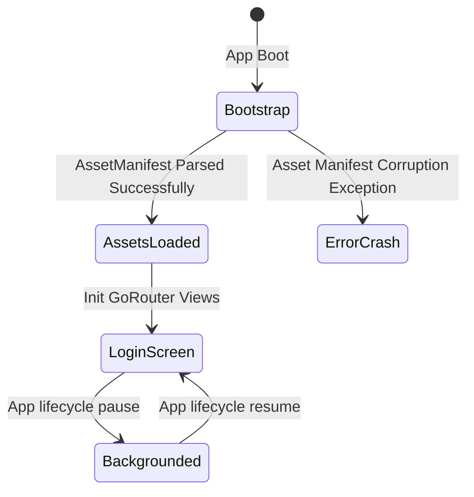

## 2. Authentication State Diagram
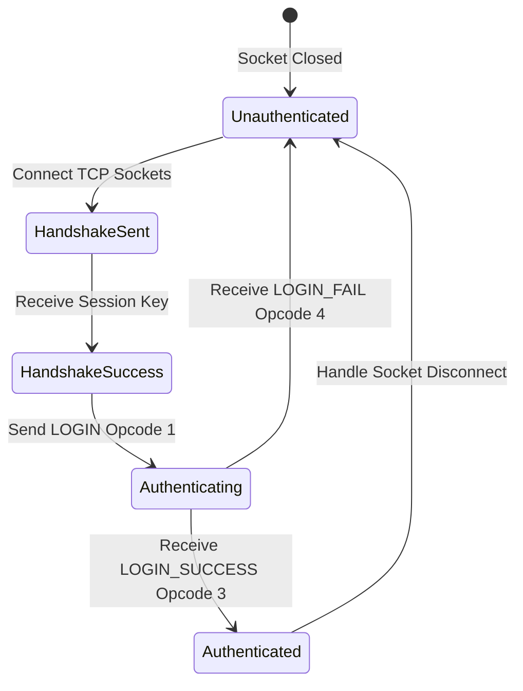

## 3. Data Sync State Diagram
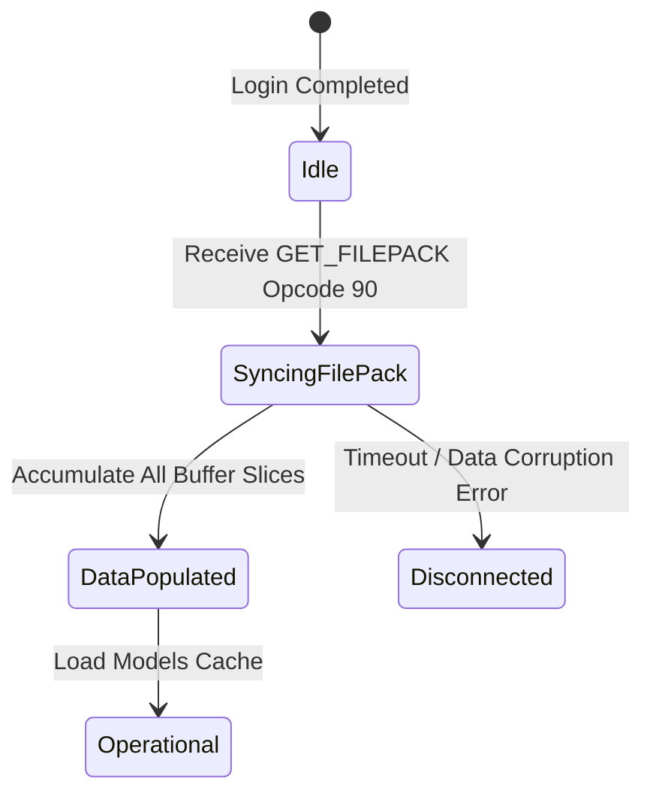

## 4. Lobby State Diagram
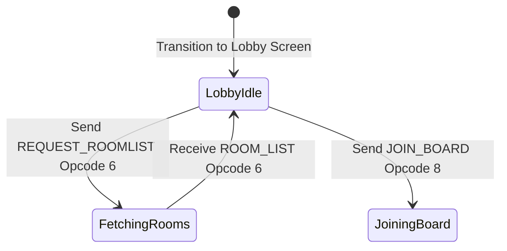

## 5. Room State Diagram
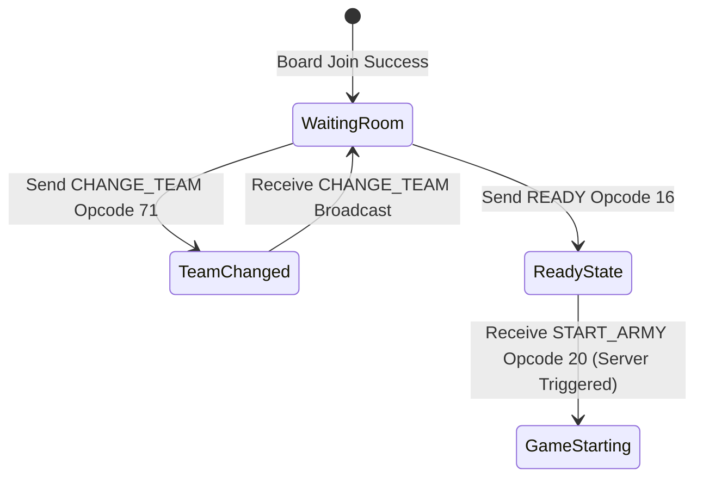

## 6. Match State Diagram
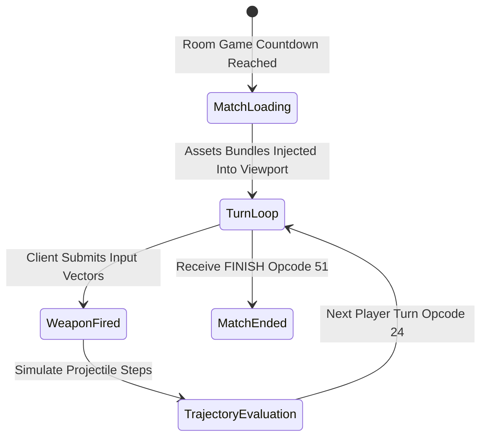

## 7. Player State Diagram
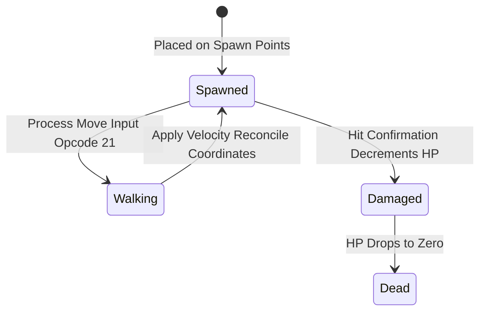

## 8. Projectile State Diagram
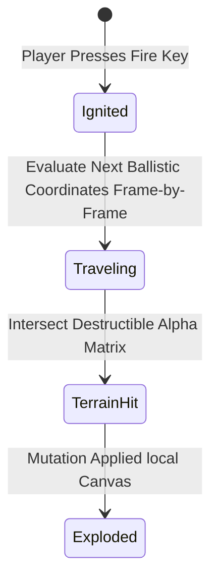

## 9. Item Status State Diagram
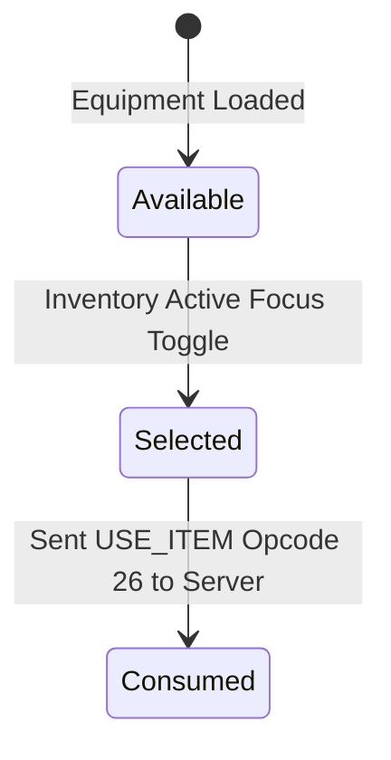

## 10. Boss State Diagram
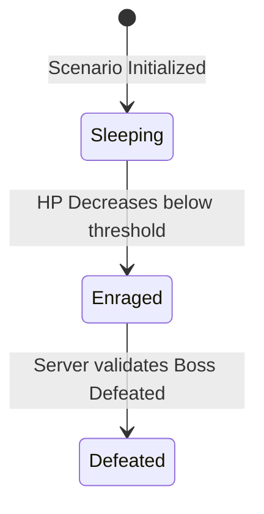

## 11. Shop Transaction State Diagram
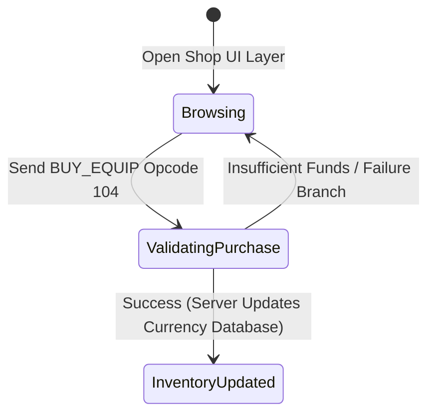
